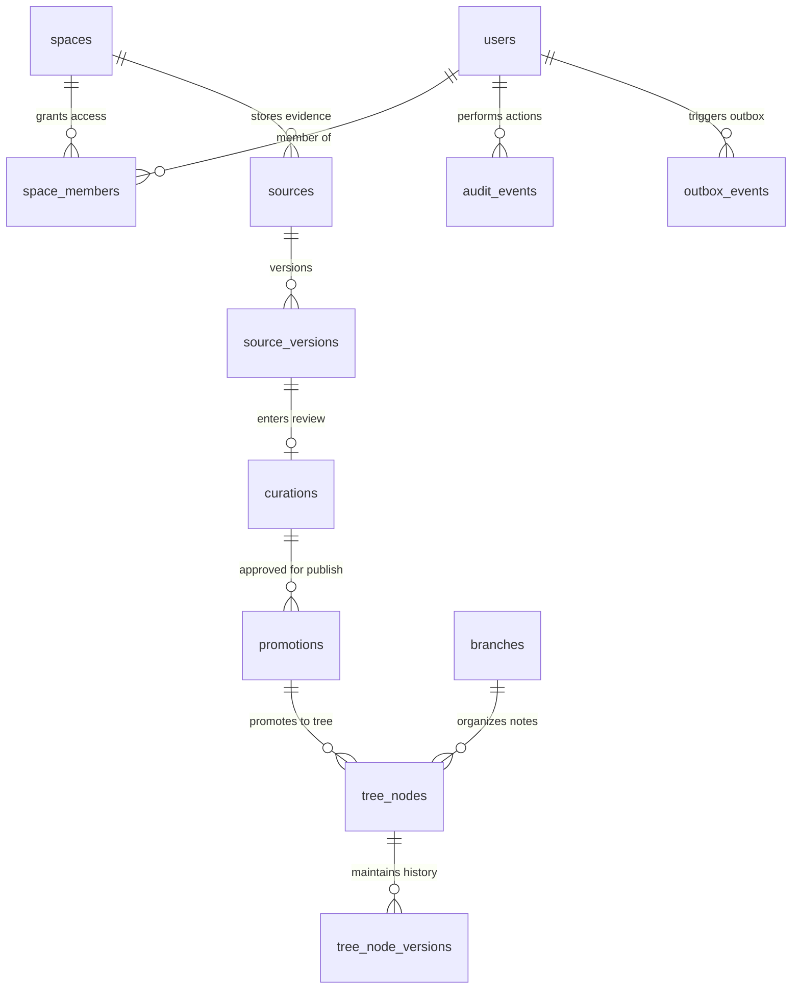
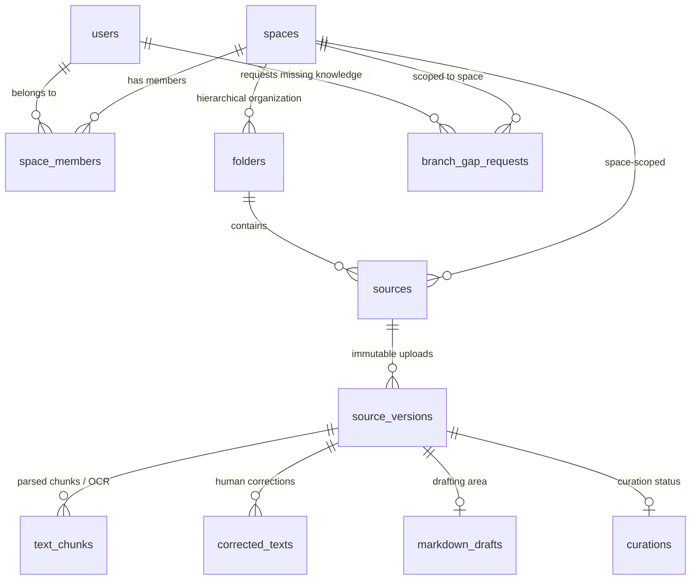
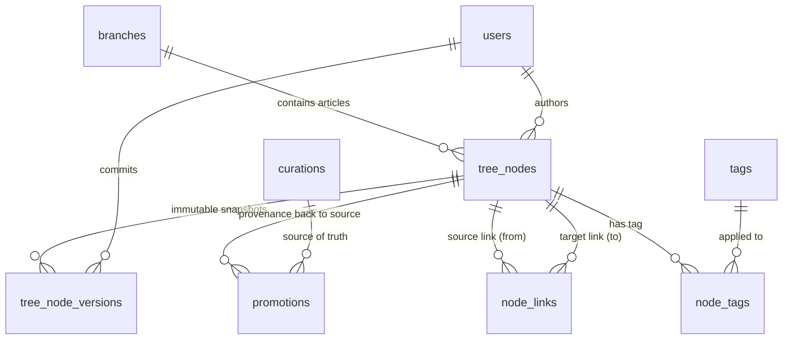
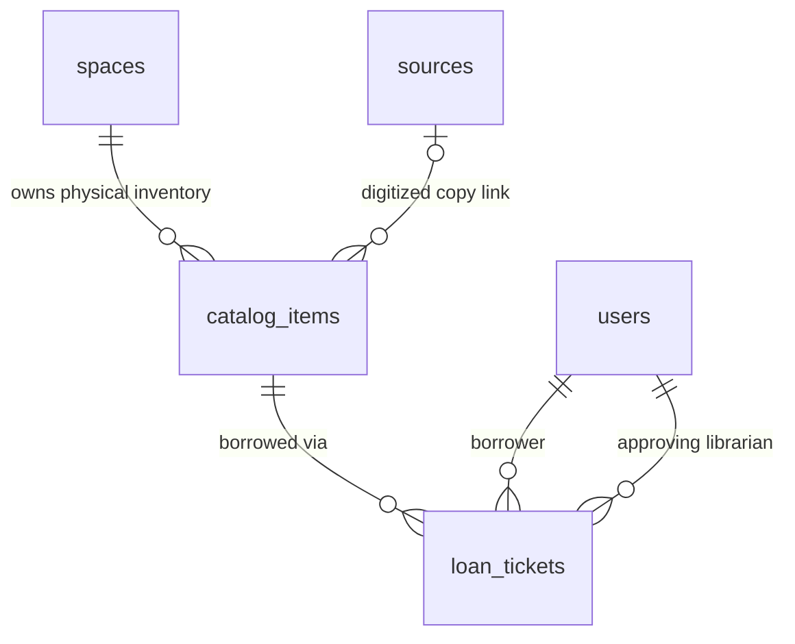
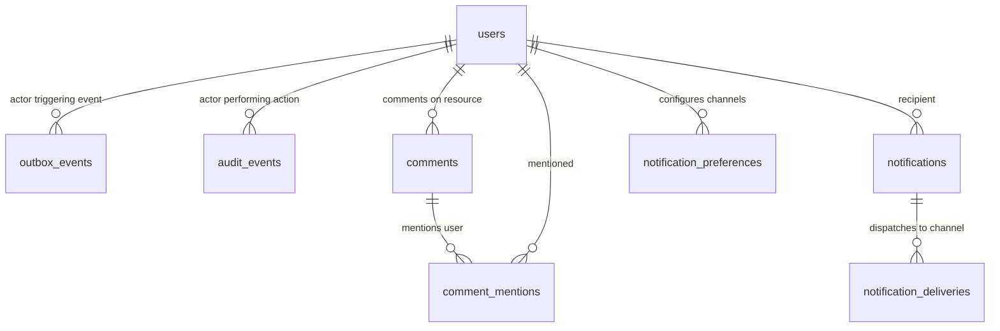
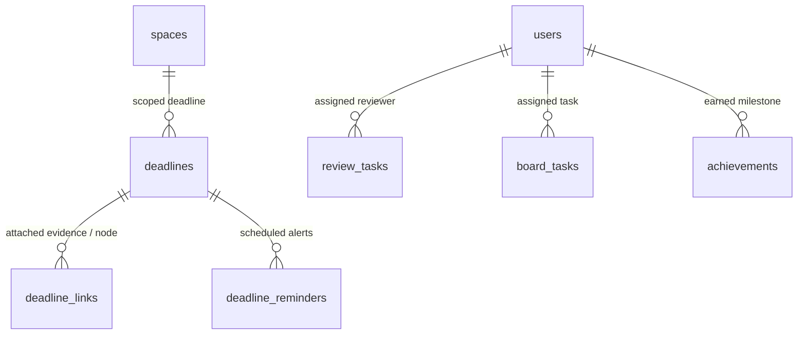

# Database Entity-Relationship Diagrams (ERDs) — Overview & Module Layout

## Purpose

- Provide clear, comprehensive Entity-Relationship Diagrams (ERDs) in Mermaid format to give engineers, architects, and AI agents an immediate visual overview of how objects and entities are organized across the database.
- Complement the table specifications in [`database-schema.md`](./database-schema.md) and the presentation `.drawio` figures in [`../diagrams/`](../diagrams/).

## Generated Draw.io ERD Files

Every Mermaid ERD in this document is also automatically compiled into a `.drawio` diagram in [`docs/diagrams/`](../diagrams/) via [`scripts/gen-diagrams.mjs`](../../scripts/gen-diagrams.mjs):

| Section | ERD Scope | `.drawio` File |
| :--- | :--- | :--- |
| **1** | Global Provenance Spine & Two-Repository Core | `docs/diagrams/erd-1-provenance-spine.drawio` |
| **2** | Storage & Ingestion Module (`storage`, `auth`) | `docs/diagrams/erd-2-storage-ingestion.drawio` |
| **3** | Knowledge Tree & Curation Module (`knowledge`) | `docs/diagrams/erd-3-knowledge-tree.drawio` |
| **4** | Catalog & Circulation Module (`catalog`, `circulation`) | `docs/diagrams/erd-4-catalog-circulation.drawio` |
| **5** | Notification, Outbox & Audit Module (`notify`, `audit`) | `docs/diagrams/erd-5-notify-audit.drawio` |
| **6** | Project Management & Collaboration Module (`pm`) | `docs/diagrams/erd-6-project-management.drawio` |

---

## 1. Global Provenance Spine & Core Two-Repository ERD

WisdomTree operates on a **Two-Repository Architecture**:
- **Source Repo (Storage)**: canonical, store-first evidence home grouped by Spaces.
- **Knowledge Tree**: curated, Markdown-first articles published from verified evidence.

The **Provenance Spine** connects these two worlds: `spaces` → `sources` → `source_versions` → `curations` → `promotions` → `tree_nodes`.

---

## 2. Storage & Ingestion Module ERD (`storage`, `auth`)

Manages spaces, membership permissions, original file ingest, OCR fallback, text extraction, corrected text flows, Markdown drafting, and gap requests.

### Storage Entity Highlights

- **`spaces` / `space_members`**: Defines whether an entity belongs to a Team Space or a Personal Space, enforcing strict authorization at query time.
- **`source_versions`**: Immutable SHA-256 record of the original uploaded file; never overwritten.
- **`curations` & `corrected_texts`**: Separates raw extracted OCR text from human-verified transcriptions and Markdown drafts.

---

## 3. Knowledge Tree & Curation Module ERD (`knowledge`)

Manages the canonical Markdown knowledge articles, branches, node version snapshots, internal links (Wiki-links graph), and tag taxonomies.

### Knowledge Tree Entity Highlights

- **`tree_nodes`**: The live, current state of a knowledge article, sorted by `updated_at DESC`.
- **`tree_node_versions`**: Immutable audit snapshot of every content edit, verification transition (`unverified` ↔ `verified`), and merge.
- **`promotions`**: The bridge entity linking a `tree_node_version` to the exact `curation` / `source_version` that justified its creation.
- **`node_links`**: Powers the interactive knowledge graph and backlink discovery (`[[Wiki-links]]`).

---

## 4. Catalog & Circulation Module ERD (`catalog`, `circulation`)

Manages the physical library (Thư viện Sách & Tài liệu vật lý), digitizing links to the Source Repo, and managing borrow-return ticket lifecycles.

### Catalog & Circulation Entity Highlights

- **`catalog_items`**: Represents a physical book, binder, or artifact in the team's library (`available`, `borrowed`, `repair`, `lost`).
- **`loan_tickets`**: Tracks the loan state machine (`requested` → `approved` → `borrowed` → `returned` / `overdue`).
- **`sources` ↔ `catalog_items`**: Optional link allowing a physical book entry to point directly to its scanned PDF version in the Source Repo.

---

## 5. Notification, Outbox & Audit Module ERD (`notify`, `audit`)

Implements the **Transactional Outbox Pattern** and immutable audit trail to guarantee zero event loss across serverless/edge environments.

### Notification & Audit Entity Highlights

- **`outbox_events`**: Created inside the same ACID PostgreSQL transaction as domain mutations (`dispatched_at IS NULL`). Drained by `after()` and authenticated `POST /api/cron/dispatch`.
- **`notifications` & `notification_deliveries`**: Separate records tracking in-app alerts vs. outbound Zalo OA / email delivery status.
- **`audit_events`**: Append-only compliance log recording who changed what, when, and from which IP/session.

---

## 6. Project Management & Collaboration ERD (`pm`)

Manages team deadlines, review tasks, board tasks, and achievement milestones.

### Project Management Entity Highlights

- **`deadlines` & `deadline_links`**: Team calendar milestones that can link directly to supporting documents in `sources` or `tree_nodes`.
- **`review_tasks`**: Work queue items assigned to Editors or Admin/Op for curation review, correction, and publication approval.

---

## Cross-Cutting Design Principles

1. **Space Scoping**: Almost every storage, catalog, and deadline object contains a `space_id` FK. The application layer (`authorize()`) enforces space membership before query execution.
2. **Optimistic Locking**: Mutation tables include `version integer NOT NULL DEFAULT 1`. Concurrency updates enforce `WHERE id = $1 AND version = $2` to detect and safely escalate conflicts.
3. **Soft Retirement**: Deletions are forbidden on canonical records; entities transition to `status = 'archived'` or `state = 'retired'`.
