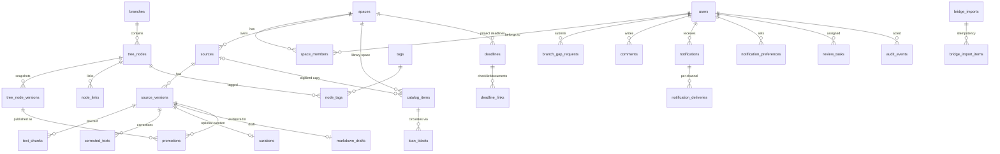

# Database Schema Design

## Purpose

- Translate the entity and lifecycle model into a concrete PostgreSQL schema an implementer can turn into migrations without reopening business decisions.
- Replace the outdated `docs/diagrams/entity-relationship-diagram.drawio` as the canonical ERD for implementation.

## In Scope

- Tables, columns, types, constraints, and indexes for every V1 entity, grouped by owning module.
- Cross-cutting patterns: optimistic locking, transactional outbox, audit, worker job state.
- The mapping from each non-functional requirement to the schema mechanism that satisfies it.

## Out of Scope

- Migration tooling and file layout.
- Phase 1.5 embedding population (the column is designed now, filled later).
- Search ranking configuration beyond index definitions.

## Decisions

- One PostgreSQL database; tables are grouped by owning module with a module prefix in this document, not by separate Postgres schemas, to keep single-operator tooling simple. Cross-module reads go through the owning module's service, per [`../platform/module-map.md`](../platform/module-map.md); foreign keys across modules are allowed because they encode integrity, not access.
- Every mutable business table carries `version int` for optimistic locking; every table carries `created_at`, mutable tables also `updated_at`.
- Primary keys are `uuid` (generated) except append-only high-volume tables (`audit_events`, `outbox_events`), which use `bigint identity`.
- Raw extracted text is append-only: `text_chunks` rows are never updated or deleted; corrected text is a separate versioned table.
- All state columns are `text` with `CHECK` constraints (not Postgres enums), so adding a state is a constraint change, not a type migration.
- `intake_items` is a SQL view over sources and branch-gap requests, matching the "logical projection" definition in [`../system/data-model-lifecycle.md`](../system/data-model-lifecycle.md).
- Events use a transactional outbox table written in the same transaction as the mutation; `notify`, `search`, and `export` consume from it.
- Full-text search uses generated `tsvector` columns with the `simple` configuration plus `unaccent`; PostgreSQL has no Vietnamese stemmer, and diacritics-insensitive matching is the practical target.
- `text_chunks.embedding` is a nullable pgvector column added in Phase 1.5 by `ALTER TABLE`; it is documented here so the chunk design never needs rework.

## Dependencies

- Entities and lifecycles in [`../system/data-model-lifecycle.md`](../system/data-model-lifecycle.md) and [`../flows/state-machines.md`](../flows/state-machines.md).
- Catalog and circulation in [`../system/catalog-circulation.md`](../system/catalog-circulation.md).
- Notifications and comments in [`../system/notifications.md`](../system/notifications.md).
- Google bridge in [`../system/google-bridge.md`](../system/google-bridge.md).
- Module ownership in [`../platform/module-map.md`](../platform/module-map.md).
- Quality targets in [`../requirements/non-functional-requirements.md`](../requirements/non-functional-requirements.md).

## Acceptance Criteria

- Every entity named in `data-model-lifecycle.md`, `catalog-circulation.md`, and `notifications.md` maps to exactly one table or view here.
- Every lifecycle state in `state-machines.md` appears in the corresponding `CHECK` constraint.
- Every NFR in the mapping table at the end points at a concrete schema mechanism.
- An implementer can write the initial migration from this document alone.

## Entity-Relationship Overview



Comments, review tasks, conflicts, and audit events reference their target polymorphically (`target_type` + `target_id`), so they attach to any module's objects without foreign-key fan-out.

## Conventions

- `uuid` PKs default `gen_random_uuid()`; timestamps are `timestamptz`.
- `version int NOT NULL DEFAULT 1`: every `UPDATE` must include `WHERE id = $1 AND version = $2` and set `version = version + 1`; zero rows updated surfaces a conflict (see conflict handling below).
- Actor columns (`created_by`, `assigned_to`, `handled_by`, …) are FKs to `users(id)`, never free text.
- Soft retirement uses lifecycle states (`archived`), never `DELETE`, matching "archive is never silent deletion".

## Module: auth

### users

| Column | Type | Constraints |
| --- | --- | --- |
| `id` | uuid | PK |
| `google_sub` | text | UNIQUE NOT NULL — OIDC subject |
| `email` | text | UNIQUE NOT NULL |
| `display_name` | text | NOT NULL |
| `role` | text | NOT NULL CHECK IN (`user`, `editor`, `admin_op`) |
| `zalo_user_id` | text | NULL — set when the member connects Zalo OA |
| `locale` | text | NOT NULL DEFAULT `vi` |
| `disabled_at` | timestamptz | NULL |
| `created_at` / `updated_at` | timestamptz | NOT NULL |
| `version` | int | NOT NULL DEFAULT 1 |

Sessions are framework-managed (cookie sessions backed by Redis); no session table in Postgres.

## Module: storage

### spaces

| Column | Type | Constraints |
| --- | --- | --- |
| `id` | uuid | PK |
| `name` | text | NOT NULL |
| `type` | text | NOT NULL CHECK IN (`team`, `personal`) |
| `owner_user_id` | uuid | FK users, NULL — set only for `personal`; UNIQUE partial index WHERE type = `personal` (one personal space per member) |
| `created_by` | uuid | FK users NOT NULL |
| `archived_at` | timestamptz | NULL |
| `created_at` / `updated_at` / `version` | | as conventions |

The community library is a `team` space; catalog items point at it. No dedicated space type is needed.

### space_members

| Column | Type | Constraints |
| --- | --- | --- |
| `space_id` | uuid | FK spaces |
| `user_id` | uuid | FK users |
| `added_by` | uuid | FK users NOT NULL |
| `created_at` | timestamptz | NOT NULL |

PK `(space_id, user_id)`. Personal spaces get exactly one row (the owner) at creation. This table is the single source of truth for all space-scoped authorization (see [`authorization-design.md`](./authorization-design.md)).

### sources

| Column | Type | Constraints |
| --- | --- | --- |
| `id` | uuid | PK |
| `space_id` | uuid | FK spaces NOT NULL |
| `title` | text | NOT NULL |
| `description` | text | NULL |
| `trust_status` | text | NOT NULL DEFAULT `unknown` CHECK IN (`unknown`, `candidate`, `trusted`, `rejected`, `archived`) |
| `submitted_by` | uuid | FK users NOT NULL — uploader accountability |
| `assigned_to` | uuid | FK users NULL — Admin/Op assignment |
| `current_version_id` | uuid | FK source_versions NULL (set after first version stores) |
| `created_at` / `updated_at` / `version` | | as conventions |

Indexes: `(space_id, updated_at DESC)` for Library listing; `(submitted_by)` for My Submissions.

### source_versions

| Column | Type | Constraints |
| --- | --- | --- |
| `id` | uuid | PK |
| `source_id` | uuid | FK sources NOT NULL |
| `seq` | int | NOT NULL; UNIQUE `(source_id, seq)` |
| `original_object_key` | text | NOT NULL — opaque S3 key |
| `original_filename` | text | NOT NULL |
| `mime_type` | text | NOT NULL — validated against [`../requirements/intake-constraints.md`](../requirements/intake-constraints.md) |
| `size_bytes` | bigint | NOT NULL CHECK ≤ 104857600 (100 MB) |
| `checksum_sha256` | text | NOT NULL — dedup hint and integrity check |
| `storage_state` | text | NOT NULL DEFAULT `uploaded` CHECK IN (`uploaded`, `stored`, `quarantined`, `archived`) |
| `extraction_status` | text | NOT NULL DEFAULT `pending` CHECK IN (`pending`, `processed`, `unprocessable`) |
| `extraction_meta` | jsonb | NULL — parser/OCR engine, confidence, warnings |
| `preview_object_keys` | jsonb | NULL |
| `uploaded_by` | uuid | FK users NOT NULL |
| `stored_at` | timestamptz | NULL — set at `uploaded → stored` |
| `created_at` / `updated_at` / `version` | | as conventions |

`quarantined` is the safety-scan holding state from `intake-constraints.md`: not visible in Library, resolvable by Admin/Op to `stored` or `archived`. `storage_state` and `extraction_status` are deliberately two columns: the store-first guarantee ("extraction never gates availability") is structural, not procedural.

### text_chunks (append-only)

| Column | Type | Constraints |
| --- | --- | --- |
| `id` | uuid | PK |
| `source_version_id` | uuid | FK source_versions NOT NULL |
| `position` | int | NOT NULL; UNIQUE `(source_version_id, position)` |
| `ref_type` | text | NOT NULL CHECK IN (`page`, `paragraph`) |
| `ref_label` | text | NOT NULL — e.g. `p.14`, `¶ 3` |
| `content` | text | NOT NULL |
| `tsv` | tsvector | GENERATED from `unaccent(content)`, GIN index |
| `embedding` | vector | NULL — added by `ALTER TABLE` in Phase 1.5 (pgvector) |
| `created_at` | timestamptz | NOT NULL |

Immutability is enforced twice: the app role has no `UPDATE`/`DELETE` grant on this table, and a `BEFORE UPDATE OR DELETE` trigger raises. Chunks carry position references so future cited answers point at exact locations without re-extraction.

### corrected_texts

| Column | Type | Constraints |
| --- | --- | --- |
| `id` | uuid | PK |
| `source_version_id` | uuid | FK source_versions NOT NULL |
| `seq` | int | NOT NULL; UNIQUE `(source_version_id, seq)` |
| `content` | text | NOT NULL |
| `edited_by` | uuid | FK users NOT NULL — editor/updater accountability |
| `created_at` | timestamptz | NOT NULL |

Each save appends a new row (the "corrected text version chain"); the latest `seq` is current. No updates, so no `version` column.

### curations

| Column | Type | Constraints |
| --- | --- | --- |
| `id` | uuid | PK |
| `source_version_id` | uuid | FK source_versions UNIQUE NOT NULL — at most one curation per version |
| `state` | text | NOT NULL CHECK IN (`under_correction`, `ready_for_review`, `promoted`, `rejected`) |
| `assigned_to` | uuid | FK users NULL |
| `nominated_by` | uuid | FK users NOT NULL |
| `created_at` / `updated_at` / `version` | | as conventions |

Curation is an optional overlay on storage, so it is its own table, not columns on `source_versions`; a stored item with no row here is simply "stored, never nominated".

### markdown_drafts

| Column | Type | Constraints |
| --- | --- | --- |
| `id` | uuid | PK |
| `source_version_id` | uuid | FK source_versions UNIQUE NOT NULL |
| `content_md` | text | NOT NULL |
| `suggested_branch_id` | uuid | FK branches NULL |
| `created_by` | uuid | FK users NOT NULL |
| `created_at` / `updated_at` / `version` | | as conventions |

### branch_gap_requests

| Column | Type | Constraints |
| --- | --- | --- |
| `id` | uuid | PK |
| `title` | text | NOT NULL |
| `description` | text | NULL |
| `state` | text | NOT NULL DEFAULT `submitted` CHECK IN (`submitted`, `triaged`, `converted_to_branch`, `rejected`, `archived`) |
| `submitted_by` | uuid | FK users NOT NULL |
| `triaged_by` | uuid | FK users NULL |
| `converted_branch_id` | uuid | FK branches NULL |
| `converted_node_id` | uuid | FK tree_nodes NULL |
| `created_at` / `updated_at` / `version` | | as conventions |

### intake_items (view)

```sql
CREATE VIEW intake_items AS
SELECT id AS submission_id, 'source' AS item_type, title,
       trust_status AS state, submitted_by, updated_at AS last_updated_at
FROM sources
UNION ALL
SELECT id, 'branch_gap_request', title, state, submitted_by, updated_at
FROM branch_gap_requests;
```

Backs `Source Intake`, `My Submissions`, and `Source Inbox`; `next_action` is derived in the service layer from state.

## Module: knowledge

### branches

| Column | Type | Constraints |
| --- | --- | --- |
| `id` | uuid | PK |
| `name` | text | UNIQUE NOT NULL |
| `description` | text | NULL |
| `created_by` | uuid | FK users NOT NULL |
| `archived_at` | timestamptz | NULL |
| `created_at` / `updated_at` / `version` | | as conventions |

### tree_nodes

| Column | Type | Constraints |
| --- | --- | --- |
| `id` | uuid | PK |
| `branch_id` | uuid | FK branches NOT NULL — primary branch |
| `title` | text | NOT NULL |
| `slug` | text | UNIQUE NOT NULL — stable export/publish path |
| `content_md` | text | NOT NULL |
| `verification` | text | NOT NULL CHECK IN (`no_source`, `unverified`, `verified`, `archived`) |
| `publish` | boolean | NOT NULL DEFAULT false — Quartz front-matter flag; may be true only when `verification = 'verified'` (CHECK) |
| `canonical_node_id` | uuid | FK tree_nodes NULL — merge redirect target; non-null implies `verification = 'archived'` (CHECK) |
| `created_by` | uuid | FK users NOT NULL |
| `tsv` | tsvector | GENERATED from `unaccent(title || content_md)`, GIN index |
| `created_at` / `updated_at` / `version` | | as conventions |

### tree_node_versions (append-only)

| Column | Type | Constraints |
| --- | --- | --- |
| `id` | uuid | PK |
| `node_id` | uuid | FK tree_nodes NOT NULL |
| `seq` | int | NOT NULL; UNIQUE `(node_id, seq)` |
| `content_md` | text | NOT NULL |
| `verification` | text | NOT NULL — verification at snapshot time |
| `created_by` | uuid | FK users NOT NULL |
| `change_summary` | text | NULL |
| `created_at` | timestamptz | NOT NULL |

Written on publish and on every significant edit; single-node restore (NFR 4h target) replays from here.

### node_links

| Column | Type | Constraints |
| --- | --- | --- |
| `from_node_id` | uuid | FK tree_nodes |
| `to_node_id` | uuid | FK tree_nodes |
| `link_type` | text | NOT NULL CHECK IN (`related`, `supports`, `contrasts`, `part_of`) |

PK `(from_node_id, to_node_id, link_type)`. Backlinks and the graph surface are queries over this table; no separate backlink storage.

### tags / node_tags

- `tags(id uuid PK, name text UNIQUE NOT NULL, created_by FK users)`.
- `node_tags(node_id FK, tag_id FK, PK (node_id, tag_id))`.

### promotions (append-only)

| Column | Type | Constraints |
| --- | --- | --- |
| `id` | uuid | PK |
| `source_version_id` | uuid | FK source_versions NOT NULL |
| `node_version_id` | uuid | FK tree_node_versions NOT NULL |
| `approved_by` | uuid | FK users NOT NULL — approver/publisher accountability |
| `excerpt_chunk_ids` | uuid[] | NULL — chunk references backing the promotion |
| `created_at` | timestamptz | NOT NULL |

The provenance backbone: durable evidence-to-publication linkage (NFR data integrity) and the citation substrate for the Phase 1.5/2 AI Librarian. A curation is `promoted` when at least one row exists for any of its source version.

### review_tasks

| Column | Type | Constraints |
| --- | --- | --- |
| `id` | uuid | PK |
| `task_type` | text | NOT NULL CHECK IN (`correction`, `gap_triage`, `publish`, `merge`, `archive`, `operational`) |
| `target_type` | text | NOT NULL CHECK IN (`source_version`, `branch_gap_request`, `markdown_draft`, `tree_node`, `conflict`) |
| `target_id` | uuid | NOT NULL |
| `state` | text | NOT NULL CHECK IN (`queued`, `assigned`, `in_review`, `changes_requested`, `approved`, `rejected`) |
| `assigned_to` | uuid | FK users NULL |
| `created_by` | uuid | FK users NOT NULL |
| `resolved_by` | uuid | FK users NULL |
| `created_at` / `updated_at` / `version` | | as conventions |

Index `(state, task_type)` for the review queue.

### conflicts

| Column | Type | Constraints |
| --- | --- | --- |
| `id` | uuid | PK |
| `target_type` | text | NOT NULL CHECK IN (`tree_node`, `corrected_text`, `markdown_draft`, `branch`) |
| `target_id` | uuid | NOT NULL |
| `state` | text | NOT NULL CHECK IN (`detected`, `locked`, `resolving`, `resolved`, `archived_conflict`) |
| `base_version` | int | NOT NULL — the version the losing save targeted |
| `attempted_payload` | jsonb | NOT NULL — the rejected save, preserved so no work is lost |
| `attempted_by` | uuid | FK users NOT NULL |
| `resolved_by` | uuid | FK users NULL |
| `resolution` | jsonb | NULL — chosen canonical outcome |
| `created_at` / `updated_at` / `version` | | as conventions |

Created when an optimistic-lock save is rejected and the user asks to escalate rather than rebase; both competing versions survive until Admin/Op resolves.

## Modules: catalog and circulation

### catalog_items

| Column | Type | Constraints |
| --- | --- | --- |
| `id` | uuid | PK |
| `item_code` | text | UNIQUE NOT NULL — auto-issued, printable (QR/barcode later); format `LIB-000001` |
| `title` | text | NOT NULL |
| `author` | text | NULL |
| `cover_photo_key` | text | NULL — S3 key |
| `location` | text | NULL — shelf or zone label |
| `status` | text | NOT NULL DEFAULT `available` CHECK IN (`available`, `borrowed`, `lost`, `repair`) |
| `space_id` | uuid | FK spaces NOT NULL — the library space |
| `linked_source_id` | uuid | FK sources NULL — digitization bridge |
| `import_id` | uuid | FK bridge_imports NULL — provenance of bulk load |
| `created_by` | uuid | FK users NOT NULL |
| `created_at` / `updated_at` / `version` | | as conventions |

Index: trigram or tsvector on `(title, author)` for librarian search; `(space_id, status)`.

### loan_tickets

| Column | Type | Constraints |
| --- | --- | --- |
| `id` | uuid | PK |
| `item_id` | uuid | FK catalog_items NOT NULL |
| `borrower_id` | uuid | FK users NOT NULL |
| `state` | text | NOT NULL DEFAULT `requested` CHECK IN (`requested`, `approved`, `declined`, `borrowed`, `overdue`, `returned`) |
| `requested_at` | timestamptz | NOT NULL |
| `approved_at` / `borrowed_at` / `due_at` / `returned_at` | timestamptz | NULL |
| `handled_by` | uuid | FK users NULL — librarian |
| `created_at` / `updated_at` / `version` | | as conventions |

"One active loan per item" is a partial unique index: `UNIQUE (item_id) WHERE state IN ('requested','approved','borrowed','overdue')`. The overdue sweep is a scheduled job flipping `borrowed → overdue` past `due_at` and emitting `loan.overdue`.

## Module: pm

### deadlines

| Column | Type | Constraints |
| --- | --- | --- |
| `id` | uuid | PK |
| `space_id` | uuid | FK spaces NOT NULL — the project's space |
| `title` | text | NOT NULL |
| `type` | text | NOT NULL CHECK IN (`conference`, `funding`, `report`, `milestone`) |
| `due_at` | timestamptz | NOT NULL |
| `reminder_offsets` | interval[] | NOT NULL DEFAULT `{7 days, 1 day}` |
| `created_by` | uuid | FK users NOT NULL |
| `created_at` / `updated_at` / `version` | | as conventions |

Reminder dispatch: a scheduled job emits `deadline.approaching` once per (deadline, offset); sent offsets are recorded in `deadline_reminders(deadline_id, offset, sent_at, PK(deadline_id, offset))` so reminders are idempotent.

### deadline_links

- `deadline_links(deadline_id FK, target_type CHECK IN ('task','source','tree_node'), target_id uuid, PK (deadline_id, target_type, target_id))` — the checklist and linked documents.

### tasks

| Column | Type | Constraints |
| --- | --- | --- |
| `id` | uuid | PK |
| `title` | text | NOT NULL |
| `state` | text | NOT NULL CHECK IN (`todo`, `doing`, `done`, `archived`) |
| `assigned_to` | uuid | FK users NULL |
| `target_type` / `target_id` | text / uuid | NULL — optional link to knowledge-work object |
| `created_by` | uuid | FK users NOT NULL |
| `created_at` / `updated_at` / `version` | | as conventions |

### achievements

- `achievements(id uuid PK, title text NOT NULL, branch_id FK branches NULL, logged_by FK users NOT NULL, achieved_at timestamptz NOT NULL, created_at)`.

### calendar_tokens

| Column | Type | Constraints |
| --- | --- | --- |
| `token` | text | PK — unguessable (≥ 128-bit random, URL-safe) |
| `user_id` | uuid | FK users NOT NULL — feed scoped to this subscriber's space visibility |
| `space_id` | uuid | FK spaces NULL — optional per-project narrowing |
| `revoked_at` | timestamptz | NULL |
| `created_at` | timestamptz | NOT NULL |

`GET /calendar/:token.ics` resolves the token, checks `revoked_at`, and renders deadlines visible to that user; no Google credentials involved.

## Module: notify

### comments (append-only)

| Column | Type | Constraints |
| --- | --- | --- |
| `id` | uuid | PK |
| `anchor_type` | text | NOT NULL CHECK IN (`source`, `tree_node`, `loan_ticket`, `deadline`) |
| `anchor_id` | uuid | NOT NULL |
| `parent_comment_id` | uuid | FK comments NULL — threading |
| `author_id` | uuid | FK users NOT NULL |
| `body` | text | NOT NULL |
| `mentions` | uuid[] | NOT NULL DEFAULT `{}` |
| `created_at` | timestamptz | NOT NULL |

Index `(anchor_type, anchor_id, created_at)`. Visibility is resolved from the anchor object's scope at read time (see [`authorization-design.md`](./authorization-design.md)); comments never mutate the anchor.

### notifications

- `notifications(id uuid PK, user_id FK users NOT NULL, event_type text NOT NULL, payload jsonb NOT NULL, read_at timestamptz NULL, created_at)`; index `(user_id, read_at, created_at DESC)`.

### notification_deliveries

| Column | Type | Constraints |
| --- | --- | --- |
| `id` | uuid | PK |
| `notification_id` | uuid | FK notifications NOT NULL |
| `channel` | text | NOT NULL CHECK IN (`in_app`, `email`, `zalo`) |
| `state` | text | NOT NULL DEFAULT `pending` CHECK IN (`pending`, `sent`, `failed`) |
| `attempts` | int | NOT NULL DEFAULT 0 |
| `last_error` | text | NULL |
| `created_at` / `updated_at` | | |

Best-effort with retry: a `failed` delivery after max attempts stays visible in the in-app center; channel outages never touch the triggering workflow (it only wrote the outbox row).

### notification_preferences

- `notification_preferences(user_id FK, event_type text, channels text[] NOT NULL, PK (user_id, event_type))`; absent row means the default matrix in [`../system/notifications.md`](../system/notifications.md).

## Module: bridge-google

### bridge_imports

| Column | Type | Constraints |
| --- | --- | --- |
| `id` | uuid | PK |
| `kind` | text | NOT NULL CHECK IN (`drive`, `sheet_catalog`, `sheet_metrics`, `forms`) |
| `config` | jsonb | NOT NULL — folder/sheet id, target space, column mapping |
| `state` | text | NOT NULL CHECK IN (`configured`, `running`, `succeeded`, `failed`) |
| `watermark` | text | NULL — last ingested row/timestamp for Forms polling |
| `last_run_at` | timestamptz | NULL |
| `last_report` | jsonb | NULL — created/skipped/failed row report |
| `created_by` | uuid | FK users NOT NULL |
| `created_at` / `updated_at` / `version` | | as conventions |

### bridge_import_items

- `bridge_import_items(import_id FK, external_id text, target_type text, target_id uuid NULL, status CHECK IN ('created','skipped','failed'), error text NULL, created_at, PK (import_id, external_id))`.
- Idempotency: re-running an import skips any `external_id` (Drive file id, sheet row key) already present — never a duplicate, never a partial record.

## Module: export

### export_jobs

- `export_jobs(id uuid PK, scope CHECK IN ('full_tree','node'), node_id FK NULL, state CHECK IN ('queued','running','succeeded','failed'), triggered_by FK users, manifest jsonb NULL, error text NULL, created_at, updated_at)`.
- The manifest records exported slugs and commit SHA, so export failures are diagnosable and validation failures never corrupt canonical content (export reads, never writes, tree tables).

## Module: audit

### audit_events (append-only, bigint identity)

| Column | Type | Constraints |
| --- | --- | --- |
| `id` | bigint | identity PK |
| `actor_id` | uuid | FK users NOT NULL |
| `actor_role` | text | NOT NULL — role at action time, denormalized on purpose |
| `accountability` | text | NOT NULL CHECK IN (`uploader`, `editor_updater`, `approver_publisher`, `operator`) |
| `action` | text | NOT NULL — e.g. `source.upload`, `trust.change`, `node.publish`, `node.merge`, `export.trigger`, `space.member.add`, `restore.execute` |
| `target_type` / `target_id` | text / uuid | NOT NULL |
| `outcome` | text | NOT NULL CHECK IN (`success`, `denied`, `failed`) |
| `details` | jsonb | NULL — old/new state, reason |
| `created_at` | timestamptz | NOT NULL |

Written in the same transaction as the mutation by the service layer. No `UPDATE`/`DELETE` grant. Indexes `(target_type, target_id, created_at)` and `(actor_id, created_at)` support the investigation queries required by the NFR (reconstruct uploader → editor → approver for any published node).

## Cross-cutting: outbox and jobs

### outbox_events (append-only, bigint identity)

| Column | Type | Constraints |
| --- | --- | --- |
| `id` | bigint | identity PK — dispatch order |
| `event_type` | text | NOT NULL — the names in [`../system/integration-contracts.md`](../system/integration-contracts.md) |
| `payload` | jsonb | NOT NULL |
| `created_at` | timestamptz | NOT NULL |
| `dispatched_at` | timestamptz | NULL |

Written in the same transaction as the mutation. A single in-app dispatcher polls undelivered rows in id order and fans out to: `notify` (matrix lookup → notifications + deliveries), `search` (reindex job), `export` triggers, and the scorecard (events are the metric source). This one pattern carries the notification matrix, the 5-minute search freshness target, and observability counts.

### jobs

| Column | Type | Constraints |
| --- | --- | --- |
| `id` | uuid | PK |
| `job_type` | text | NOT NULL — extraction, render, reindex, drive_import, sheet_import, forms_poll, embedding (1.5) |
| `payload` | jsonb | NOT NULL |
| `idempotency_key` | text | UNIQUE NOT NULL — e.g. `extract:{source_version_id}` |
| `state` | text | NOT NULL CHECK IN (`queued`, `running`, `succeeded`, `failed`, `dead`) |
| `attempts` | int | NOT NULL DEFAULT 0 |
| `last_error` | text | NULL |
| `created_at` / `updated_at` | | |

Redis carries the wake-up signal; Postgres carries the durable state, so the operating playbook can list, retry, and replay jobs after an outage (visible degraded mode, never silent queue growth).

## NFR-to-Schema Mapping

| Requirement | Mechanism |
| --- | --- |
| Store-first guarantee | `storage_state` separate from `extraction_status`; Library queries filter only on `storage_state = 'stored'` |
| Raw text immutability | `text_chunks` grant + trigger; corrected text is a separate append-only chain |
| Accountability chain | `submitted_by` / `edited_by` / `approved_by` columns plus `audit_events.accountability` |
| Provenance of publications | `promotions` linking source version → node version with approver and excerpt chunks |
| Optimistic locking | `version` column + conditional UPDATE; rejected saves preserved in `conflicts.attempted_payload` |
| Archive reversible in history | lifecycle states + `tree_node_versions` / `corrected_texts` append-only chains; no DELETEs |
| Search freshness ≤ 5 min | generated `tsv` columns (immediate for metadata) + outbox-driven reindex jobs |
| Vietnamese search | `unaccent` + `simple` tsvector configuration |
| Cited answers (1.5/2) | position-referenced `text_chunks` + nullable `embedding` column |
| Job retry / idempotent publish | `jobs.idempotency_key` UNIQUE; publish re-run finds existing `promotions` row |
| Bridge idempotency | `bridge_import_items` PK on `(import_id, external_id)` |
| One active loan per item | partial unique index on `loan_tickets` |
| RPO 24h, single-record restore 4h | daily `pg_dump` + append-only version chains enable per-record replay |
| Space-scoped security | `space_members` as the single membership truth; every space-scoped table carries `space_id` |
| Scorecard without analytics platform | `outbox_events` + `audit_events` are queryable metric sources |
