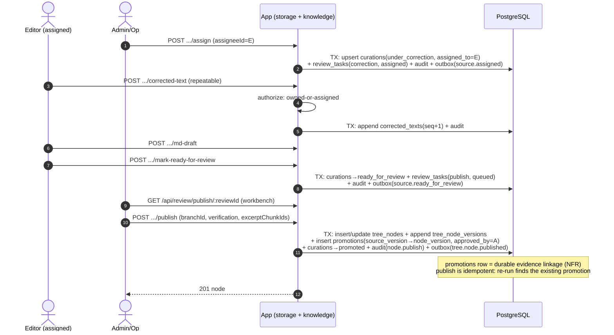
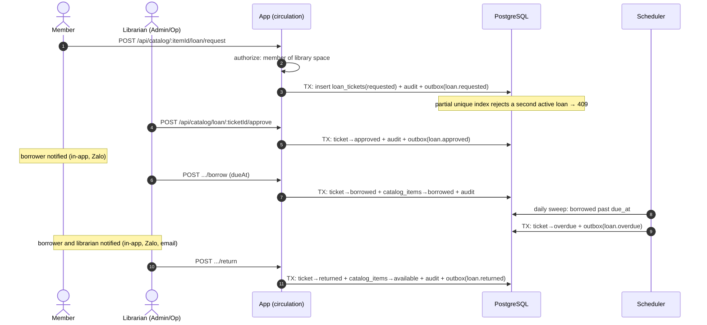

# Sequence Diagrams for Core Flows

## Purpose

- Specify the runtime interaction of the five flows that carry the platform's structural guarantees, so implementation and code review can check behavior against an explicit sequence.
- Supersede the stale `docs/diagrams/app-user-data-flows.drawio` as the implementation reference for these flows.

## In Scope

- Store-first upload and extraction.
- Curation review and publish with provenance.
- Loan request through return, including overdue.
- Drive import through the Google bridge.
- Event dispatch through the transactional outbox.

## Out of Scope

- UI navigation flows (see [`../flows/user-flows.md`](../flows/user-flows.md)).
- Retry and backoff parameters.
- Flows that are simple request-response with no cross-component behavior (ICS feed, comments, board).

## Decisions

- Every mutation follows the same shape: authorize → mutate + audit + outbox in one transaction → respond; slow work is always a worker job keyed by an idempotency key.
- The diagrams name real components from [`../platform/module-map.md`](../platform/module-map.md) and tables from [`database-schema.md`](./database-schema.md), so the sequences stay checkable against code.

## Dependencies

- Schema and outbox in [`database-schema.md`](./database-schema.md).
- Job contracts and events in [`../system/integration-contracts.md`](../system/integration-contracts.md).
- Lifecycles in [`../flows/state-machines.md`](../flows/state-machines.md).
- Authorization steps in [`authorization-design.md`](./authorization-design.md).

## Acceptance Criteria

- Each diagram shows where the transaction boundary sits and which events are emitted.
- The store-first flow makes the item available in Library before any extraction work starts.
- Failure branches show degraded behavior, not silent loss.

## Flow 1: Store-First Upload

The structural core: the user's file is safe and findable before any processing happens.

```mermaid
sequenceDiagram
    autonumber
    actor U as User
    participant App as App (storage module)
    participant S3 as Object Storage
    participant DB as PostgreSQL
    participant R as Redis
    participant W as Worker

    U->>App: POST /api/source/upload (file, spaceId, title)
    App->>App: authorize: member of spaceId; size/format checks
    App->>S3: put original object
    App->>DB: TX: insert source + source_version(storage_state=stored)<br/>+ audit(source.upload) + outbox(source.stored)
    App-->>U: 201 — item is in Library now
    Note over U,DB: Store-first guarantee: findable and downloadable from here,<br/>regardless of what extraction does next
    App->>DB: insert jobs(extract:{versionId}, queued)
    App->>R: enqueue wake-up
    W->>R: dequeue
    W->>S3: fetch original
    W->>W: parse; OCR fallback (local, Ollama-assisted)
    alt extraction succeeds
        W->>DB: TX: insert text_chunks + set extraction_status=processed<br/>+ outbox(source.processed)
        Note over DB: chunks become full-text findable within 5 min via reindex
    else unprocessable
        W->>DB: TX: set extraction_status=unprocessable + outbox(source.processing_failed)
        Note over DB: visible state, uploader notified; item stays stored in Library
    end
```

If the safety scan flags the file, the version enters `quarantined` instead of `stored` and only Admin/Op resolution continues; it never becomes silently visible.

## Flow 2: Curation Review and Publish

The optional workflow on top of storage that produces verified tree knowledge with provenance.



Rejection at any review point closes only curation (`rejected`); the stored item never leaves Library.

## Flow 3: Loan Request to Return



## Flow 4: Drive Import (Google Bridge)

```mermaid
sequenceDiagram
    autonumber
    actor A as Admin/Op
    participant App as App (bridge-google)
    participant DB as PostgreSQL
    participant W as Worker
    participant G as Google Drive API
    participant S3 as Object Storage

    A->>App: POST /api/bridge/drive/import (driveFolderId, spaceId)
    App->>DB: TX: upsert bridge_imports(drive, running) + audit
    App->>DB: insert jobs(drive_import:{importId})
    W->>G: list folder (Op-owned server credential, read-only)
    loop each file
        W->>DB: check bridge_import_items(importId, driveFileId)
        alt already imported
            W->>DB: mark skipped (idempotent re-run)
        else new file
            W->>G: download copy (Drive original untouched)
            W->>S3: put object
            W->>App: create through storage module's normal path
            App->>DB: TX: source + version(stored) + audit + outbox(source.stored)
            W->>DB: insert bridge_import_items(created, target_id)
        end
    end
    W->>DB: TX: bridge_imports→succeeded + last_report + outbox(bridge.drive.imported)
    Note over G,DB: Google outage or throttle → job retries with backoff;<br/>bridge degrades alone, storage workflows unaffected
```

Sheets import and Forms polling follow the same shape; Forms adds the `watermark` advance after each ingested batch.

## Flow 5: Outbox Event Dispatch

One pattern serves notifications, search freshness, and export triggers.

```mermaid
sequenceDiagram
    autonumber
    participant DB as PostgreSQL (outbox_events)
    participant D as Dispatcher (app loop)
    participant N as notify module
    participant Z as Zalo OA / Email
    participant J as jobs (search reindex)

    D->>DB: poll undispatched rows in id order
    D->>N: event (e.g. loan.overdue)
    N->>DB: matrix + notification_preferences lookup
    N->>DB: TX: insert notifications + notification_deliveries(pending per channel)
    N->>Z: send (email, Zalo OA)
    alt channel ok
        N->>DB: delivery→sent
    else channel down
        N->>DB: delivery attempts+1, →failed after max retries
        Note over N,Z: best-effort: alert stays visible in-app;<br/>the triggering workflow finished long ago
    end
    D->>J: enqueue reindex / export trigger when event type requires it
    D->>DB: mark outbox row dispatched
```

The dispatcher is at-least-once: consumers are idempotent (notification insert keyed by event id, reindex jobs keyed by object id), so a crash between fan-out and marking dispatched cannot double-notify or corrupt state.
