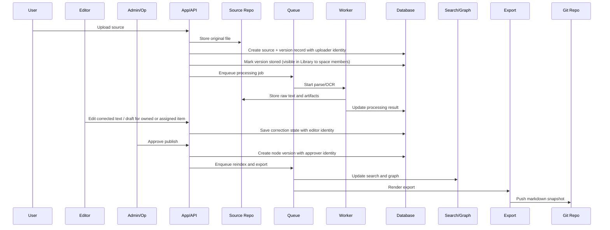

# App, User, and Data Flows

## Purpose
- Show how user actions, application orchestration, worker processing, and storage updates interact end-to-end.

## In Scope
- App flow.
- User flow.
- Data flow.
- Sync, index, and export flow.

## Out of Scope
- Detailed API payload schemas.
- Queue implementation details.
- Infrastructure monitoring internals.

## Decisions
- The app orchestrates lifecycle transitions and permissions.
- The worker performs asynchronous extraction and suggestion work.
- Search and export are downstream projections of canonical application state.

## Dependencies
- Module boundaries in [`../system/module-boundaries.md`](../system/module-boundaries.md).
- Integration contracts in [`../system/integration-contracts.md`](../system/integration-contracts.md).
- Deployment topology in [`../system/deployment-topology.md`](../system/deployment-topology.md).

## Acceptance Criteria
- The end-to-end data flow from upload to publish is visible in one document.
- Contributors can identify where asynchronous jobs begin and end.
- Search and export are clearly modeled as downstream consequences of primary actions.

## End-to-End Sequence

## App Flow Summary
- Validate permissions.
- Persist canonical records.
- Emit jobs for asynchronous work.
- Reflect operational state back to users.

## User Flow Summary
- Users upload source material, track personal submissions, and consume tree content.
- Editors create tree content and contribute to owned or assigned correction work.
- Admin/Op finalizes evidence review and publication.

## Data Flow Summary
- Source evidence enters object storage-backed Source Repo and becomes available to space members at `stored`; extraction enriches it asynchronously.
- Workflow state and tree content live in PostgreSQL.
- Search and graph are projections.
- Exported Markdown lives downstream in the private content repo.

## Error Path
- Processing failure updates source state and exposes retry/escalation options.
- Publish failure keeps source review history and node intent while blocking completion.
- Export failure creates follow-up work without rolling back the tree node.

## Permission Path
- Cross-space browsing and cross-space downloads stay behind Admin/Op authorization; in-space browse, search, and download follow space membership.
- Personal submission views stay scoped to the uploader.
- Tree reading is broadly available to authenticated users.
- Owned or assigned work limits which source correction and tree-editing surfaces Editors can modify.
