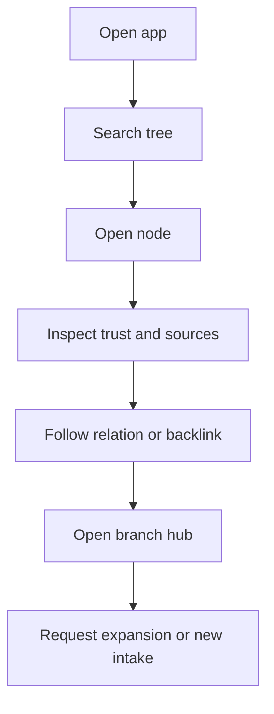

# Reader Flows

## Purpose
- Describe the reader-facing discovery and learning workflows that define the main consumption experience of the tree.

## In Scope
- Search, open node, inspect relations, expand branch, and request additional knowledge.
- Happy path, error path, and permission path for Reader usage.

## Out of Scope
- Source repository operations.
- Admin publish and review workflows.
- Low-level navigation component specs.

## Decisions
- Reader is optimized for curated knowledge discovery, not source repository operations.
- Readers see trust state and selected provenance context, but not full source internals.
- Graph exploration exists as both a dedicated surface and contextual relation view.

## Dependencies
- Role definitions in [`../product/roles-personas.md`](../product/roles-personas.md).
- Search behavior in [`../requirements/functional-spec.md`](../requirements/functional-spec.md).
- Screen details in [`../ui/reader-screen-specs.md`](../ui/reader-screen-specs.md).

## Acceptance Criteria
- Reader workflows support search, branch exploration, and trust-aware reading.
- Error and permission outcomes are explicit enough to drive UI states.
- No reader flow assumes hidden access to the source repository.

## Happy Path
1. Reader opens the app and lands in a tree-oriented home surface.
2. Reader searches by keyword, tag, branch, or concept.
3. Reader opens a node result and sees:
   - title
   - verification badge
   - excerpt or summary
   - primary branch
   - contextual relations
4. Reader follows links or mini-graph relations to adjacent nodes.
5. Reader opens the branch hub to understand topic structure and remaining gaps.
6. Reader submits a lightweight request for branch expansion or new source intake if the flow is enabled.

## Happy Path Diagram

## Error Path
- Search returns no results:
  - show empty state
  - suggest related branches or tags
  - offer request flow for missing knowledge
- Node is archived:
  - show archive badge
  - redirect toward canonical or active replacement if one exists
- Source excerpt cannot be shown:
  - preserve node access
  - display provenance unavailable message rather than hiding trust context entirely

## Permission Path
- Reader can see trust and source excerpt metadata on node pages.
- Reader cannot open full Source Repo item pages.
- Reader cannot approve, publish, merge, archive, or download original files.

