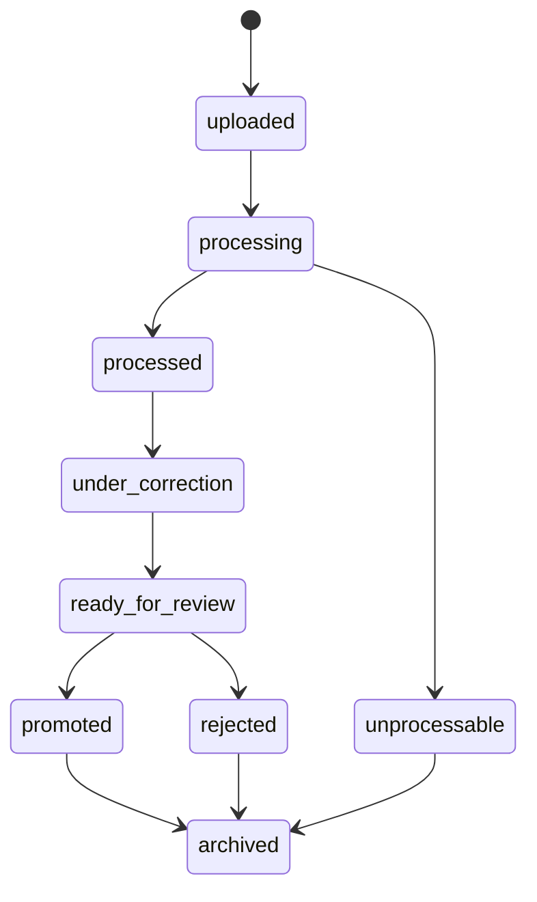
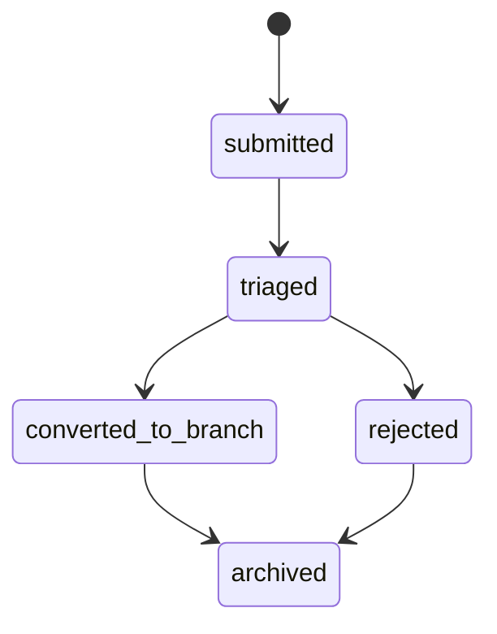
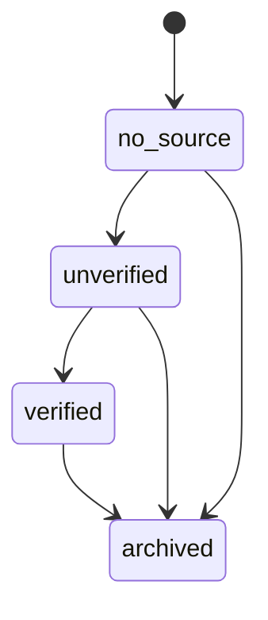
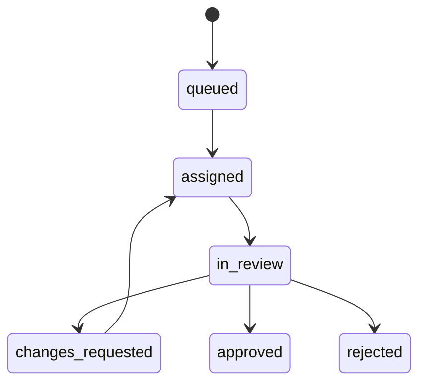
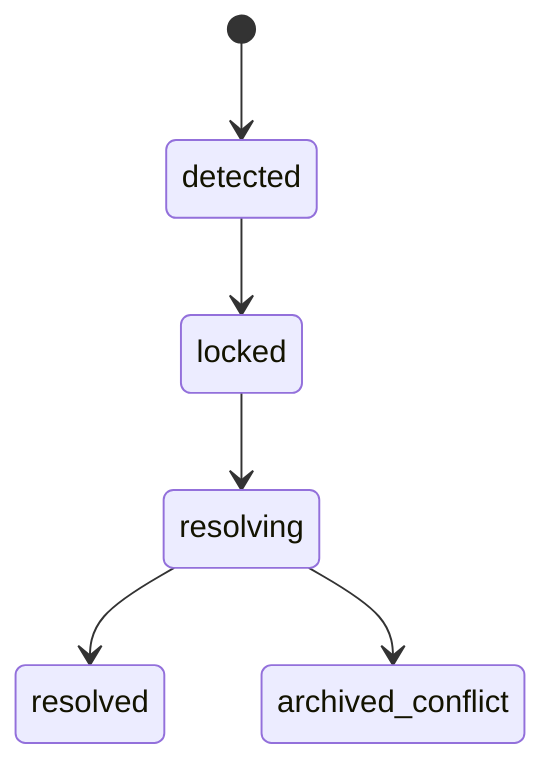

# State Machines

## Purpose
- Define the canonical lifecycle diagrams for source processing, node verification, review, and conflict handling.
- Ensure UI states, backend transitions, and audit events use the same lifecycle vocabulary.

## In Scope
- Source lifecycle.
- Node verification lifecycle.
- Review lifecycle.
- Conflict lifecycle.

## Out of Scope
- Retry policy implementation details.
- Notification delivery internals.
- Low-level storage mechanics.

## Decisions
- State machines are implementation-facing and must remain stable across docs.
- State names are shared with system and UI specifications.
- V1 favors explicit manual resolution over silent automation for conflicts.

## Dependencies
- Glossary in [`../product/glossary.md`](../product/glossary.md).
- Lifecycle rules in [`../system/data-model-lifecycle.md`](../system/data-model-lifecycle.md).
- Shared UI state handling in [`../ui/shared-states.md`](../ui/shared-states.md).

## Acceptance Criteria
- Each primary lifecycle has a Mermaid diagram and plain-language interpretation.
- No downstream document introduces conflicting lifecycle names.
- The diagrams are specific enough to drive UI state and backend transition logic.

## Source Lifecycle

Interpretation:
- `uploaded`: source accepted and stored.
- `processing`: parser or OCR is running.
- `processed`: raw text or failure artifact exists.
- `under_correction`: assigned `Editor` or `Admin/Op` correction work is in progress.
- `ready_for_review`: corrected text and draft are ready for Admin/Op review.
- `promoted`: at least one tree node was published from the source version.
- `rejected`: source reviewed but not suitable for publication.
- `unprocessable`: system cannot produce usable extraction in V1.

## Branch-gap Request Lifecycle

Interpretation:
- `submitted`: gap request accepted through `Source Intake`.
- `triaged`: `Admin/Op` reviewed the request and chose the next step.
- `converted_to_branch`: the request was turned into branch or node work.
- `rejected`: the request was reviewed and not accepted for active knowledge work.
- `archived`: historical record retained after resolution.

## Node Verification Lifecycle

Interpretation:
- `no_source`: manually created knowledge not yet backed by evidence.
- `unverified`: evidence exists but the content is not yet verified for trust.
- `verified`: reviewed and approved knowledge with evidence linkage.
- `archived`: inactive but historically preserved node.

## Review Lifecycle

Interpretation:
- `queued`: pending action.
- `assigned`: owned by a person.
- `in_review`: active review underway.
- `changes_requested`: needs more work before approval.
- `approved`: accepted for next step.
- `rejected`: stopped and closed.

## Conflict Lifecycle

Interpretation:
- `detected`: conflicting changes were found.
- `locked`: the system blocks automatic continuation.
- `resolving`: Admin/Op is selecting the canonical outcome.
- `resolved`: conflict outcome applied.
- `archived_conflict`: preserved as historical record after resolution path closes.
