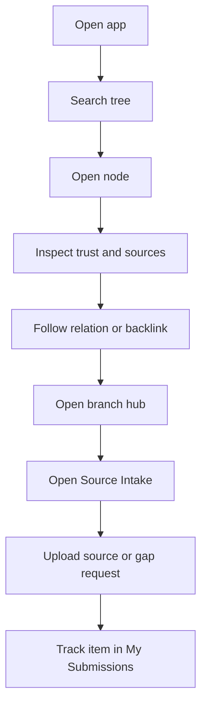

# User Flows

## Purpose
- Describe the user-facing discovery, source intake, and personal submission workflows that define the default authenticated experience.

## In Scope
- Search, open node, inspect relations, expand branch, upload source, and track personal submissions.
- Happy path, error path, and permission path for User usage.

## Out of Scope
- Source repository operations.
- Admin publish and review workflows.
- Low-level navigation component specs.

## Decisions
- `User` is the default authenticated role and combines discovery with source contribution and gap reporting.
- Users see trust state and selected provenance context, but not full source internals.
- Users can upload source items into member spaces, browse and download stored items in those spaces, and view their own submissions.
- Graph exploration exists as both a dedicated surface and contextual relation view.

## Dependencies
- Role definitions in [`../product/roles-personas.md`](../product/roles-personas.md).
- Search behavior in [`../requirements/functional-spec.md`](../requirements/functional-spec.md).
- Screen details in [`../ui/user-screen-specs.md`](../ui/user-screen-specs.md).

## Acceptance Criteria
- User workflows support search, branch exploration, trust-aware reading, source intake, and own-submission tracking.
- Error and permission outcomes are explicit enough to drive UI states.
- No user flow assumes hidden access to the source repository.

## Happy Path 0: Store and Retrieve a Team File
1. User opens `Source Intake` and uploads a file into one of their spaces.
2. System stores the file and marks it `stored`.
3. A teammate in the same space opens `Library` or search and finds the item by title, metadata, or extracted text.
4. The teammate opens the stored item, checks its metadata and preview, and downloads the original file.

## Happy Path 1: Discover Knowledge
1. User opens the app and lands in a tree-oriented home surface.
2. User searches by keyword, tag, branch, or concept.
3. User opens a node result and sees:
   - title
   - verification badge
   - excerpt or summary
   - primary branch
   - contextual relations
4. User follows links or mini-graph relations to adjacent nodes.
5. User opens the branch hub to understand topic structure and remaining gaps.
6. User decides either to continue exploration or contribute a new source item if the topic is missing.

## Happy Path 2: Submit Source and Track It
1. User opens `Source Intake` from the app shell or a contribution CTA.
2. User either submits a source file or records a `branch-gap request` when no file is available yet.
3. System acknowledges the intake and creates a personal submission record.
4. User opens `My Submissions` and sees:
   - item title
   - processing state
   - last updated timestamp
   - whether follow-up from the team is pending
5. User returns later to see that the submission has moved through processing or review.

## Happy Path Diagram

## Error Path
- Search returns no results:
  - show empty state
  - suggest related branches or tags
  - offer source intake or branch-gap request flow for missing knowledge
- Node is archived:
  - show archive badge
  - redirect toward canonical or active replacement if one exists
- Source excerpt cannot be shown:
  - preserve node access
  - display provenance unavailable message rather than hiding trust context entirely
- Upload processing fails:
  - preserve the submission record and keep the stored file available in `Library`
  - show failure state and next expected action
  - do not expose internal queue or cross-space repository details
- Download fails or storage is degraded:
  - show retry guidance
  - keep the item visible in `Library` with a degraded notice

## Permission Path
- User can see trust and source excerpt metadata on node pages.
- User can upload source items into member spaces and open their own submission list.
- User can browse `Library`, search stored items, and download originals within member spaces.
- User cannot browse, search, or download items in spaces they do not belong to, and cannot open operational review internals or other users' submission workflow detail.
- User cannot approve, publish, merge, or archive.
- User cannot edit corrected text or Markdown drafts.
