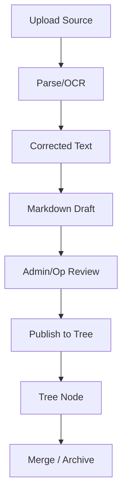

# Data Model and Lifecycle

## Purpose
- Define the lifecycle and state rules for the core V1 entities.
- Keep state machines, UI states, and backend transitions aligned.

## In Scope
- Lifecycle of source items, source versions, drafts, nodes, reviews, tasks, achievements, and conflicts.
- Merge, archive, redirect, and trust rules.

## Out of Scope
- Detailed SQL schemas.
- Search index implementation.
- Notification delivery mechanics.

## Decisions
- Source and node states are separate and must remain separate.
- Raw extracted text is immutable.
- Archive is soft retirement, never silent deletion.
- Duplicate concept resolution uses archive plus redirect.

## Dependencies
- Glossary in [`../product/glossary.md`](../product/glossary.md).
- State diagrams in [`../flows/state-machines.md`](../flows/state-machines.md).
- Architecture in [`two-repository-architecture.md`](./two-repository-architecture.md).

## Acceptance Criteria
- State transitions are specific enough to implement backend rules and UI status handling.
- Merge, archive, and publish rules can be tested without guessing business meaning.
- The lifecycle model supports both source-driven and manual tree content.

## Core Entities

### Intake Item
- Logical intake projection used by `Source Intake`, `My Submissions`, and `Source Inbox`.
- Has shared fields:
  - `submission_id`
  - `item_type`
  - `title`
  - `state`
  - `submitted_by`
  - `last_updated_at`
  - `next_action`
- May point to a file-backed `Source` or a non-file-backed `Branch-gap Request`.

### Source
- A logical evidence item submitted to the system.
- May contain many source versions over time.
- Carries trust status independent from published tree node status.
- Carries uploader identity and assignment state for accountability.

### Source Version
- Immutable representation of one uploaded file and its generated artifacts.
- Owns original file reference, raw text reference, corrected text version chain, and preview references.

### Branch-gap Request
- Non-file-backed intake record describing a missing concept, branch gap, or desired expansion.
- Does not create `SourceVersion`.
- Does not carry source trust state.
- May be converted into a branch, a node placeholder, or another tracked knowledge-work item after triage.

### Markdown Draft
- Transitional publication artifact built from corrected text.
- May be revised before approval.

### Tree Node
- Curated Markdown knowledge unit stored in PostgreSQL.
- Belongs to one primary branch.
- May carry backlinks and typed cross-links.

### Tree Node Version
- Immutable snapshot of node content after publish or significant edit.

### Review Task
- Actionable item for source correction, gap triage, publish approval, merge, archive, or operational resolution.
- Preserves who owns the working step and who approved the outcome.

### Conflict
- A state where concurrent or contradictory edits require manual resolution by Admin/Op.

## Trust and Verification States

### Source Trust
- `unknown`
- `candidate`
- `trusted`
- `rejected`
- `archived`

### Node Verification
- `no_source`
- `unverified`
- `verified`
- `archived`

## Lifecycle Rules

### Source Lifecycle
- Source version enters as `uploaded`.
- It becomes `processed` when raw text or explicit extraction failure is available.
- It becomes `under_correction` when an assigned `Editor` or `Admin/Op` is actively working on corrected text.
- It becomes `ready_for_review` when corrected text and a Markdown draft are available.
- It becomes `promoted` when at least one tree publication is approved from it.
- It becomes `rejected` when the source should not produce tree content.
- It may become `unprocessable` when processing is unsupported or fails irrecoverably.

### Branch-gap Request Lifecycle
- Branch-gap request enters as `submitted`.
- It becomes `triaged` when `Admin/Op` reviews the request and decides the next action.
- It becomes `converted_to_branch` when it creates or links to branch or node work.
- It becomes `rejected` when the request is not suitable for active knowledge work.
- It may become `archived` after the triage outcome is historically preserved.
- `branch_gap_request` never enters `under_correction`, `ready_for_review`, or `promoted`.

### Node Lifecycle
- Manual nodes begin as `no_source`.
- Source-driven nodes begin as `unverified` unless verified at publish time by Admin/Op.
- Nodes may move to `verified` after evidence and review are complete.
- Nodes may move to `archived` when superseded, merged, or retired.

### Merge and Redirect
- Duplicate concepts are resolved by choosing one canonical node.
- The non-canonical node becomes `archived`.
- Existing references redirect to the canonical node.
- Audit must preserve the merge decision and operator identity.

### Conflict Handling
- Conflicts do not auto-merge in V1.
- Conflicts must preserve both competing versions until Admin/Op resolves them.
- Resolution must record outcome and chosen canonical version.

## Accountability Rules
- Every source-derived publication must remain traceable to:
  - uploader
  - editor or updater
  - approving `Admin/Op`
- Ownership or assignment must be explicit before an `Editor` can mutate corrected text, Markdown draft, or assigned tree content.
- Every `branch-gap request` must remain traceable to:
  - `submitted_by`
  - `triaged_by`
  - final triage outcome

## Lifecycle Overview Diagram

## Task and Achievement Rules
- Tasks track knowledge workflow work, not general company project management.
- Achievements can be derived from branch milestones or logged manually.
- Neither tasks nor achievements override trust or verification states.
