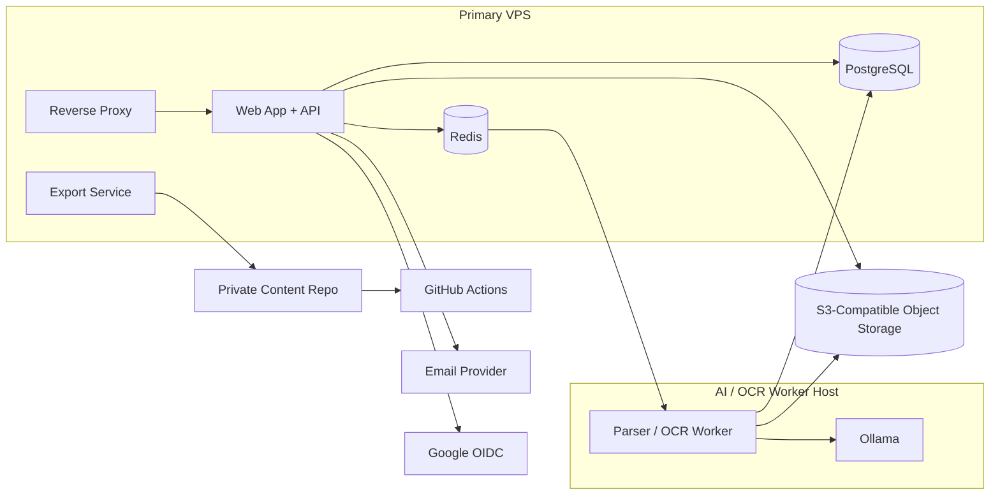

# Deployment Topology

## Purpose
- Define the runtime topology for V1, including app infrastructure, worker split, storage, and backup boundaries.
- Give implementers an operational deployment target that matches product and system assumptions.

## In Scope
- VPS app stack.
- Separate OCR/AI worker host.
- Object storage usage.
- Backup topology.
- High-level networking and operational boundaries.

## Out of Scope
- Terraform or Docker Compose manifests.
- Cloud-provider-specific scripts.
- Autoscaling beyond V1 needs.

## Decisions
- Web/API, PostgreSQL, Redis, and reverse proxy run on the primary VPS.
- OCR/Parser/AI worker runs on a separate machine with better CPU or GPU capability.
- Source files and evidence artifacts live in S3-compatible object storage.
- Backups run daily with manual restore procedures.

## Dependencies
- Context in [`system-context.md`](./system-context.md).
- Two-repository model in [`two-repository-architecture.md`](./two-repository-architecture.md).
- NFR targets in [`../requirements/non-functional-requirements.md`](../requirements/non-functional-requirements.md).

## Acceptance Criteria
- Infrastructure engineers can infer the required runtime components from this document.
- Storage and compute split is consistent with OCR/AI workload expectations.
- Backup ownership and data boundaries are explicit.

## Runtime Topology

## Component Placement
- Primary VPS:
  - reverse proxy
  - web app
  - API layer
  - PostgreSQL
  - Redis
  - export service or export runner
- Worker host:
  - parser runtime
  - OCR runtime
  - Ollama
- Shared storage:
  - source originals
  - raw extracted text
  - corrected text artifacts
  - previews

## Network and Access Assumptions
- Worker host communicates with the app stack over a private or controlled network path.
- Object storage access uses service credentials, not public buckets.
- Original file download is mediated by the app, not direct unrestricted object storage access.

## Backup Topology
- PostgreSQL:
  - daily logical backup
  - retention policy aligned with small-team operational capacity
- Object storage:
  - daily snapshot or replication
- Content repo:
  - remote private Git host as backup target
- Restore responsibility:
  - Admin/Op owns runbook validation

## Operational Notes
- V1 prioritizes simplicity and recoverability over high-availability clustering.
- A separate worker host reduces contention between OCR/AI processing and interactive app performance.
- GitHub Actions is part of content validation, not application runtime serving.

