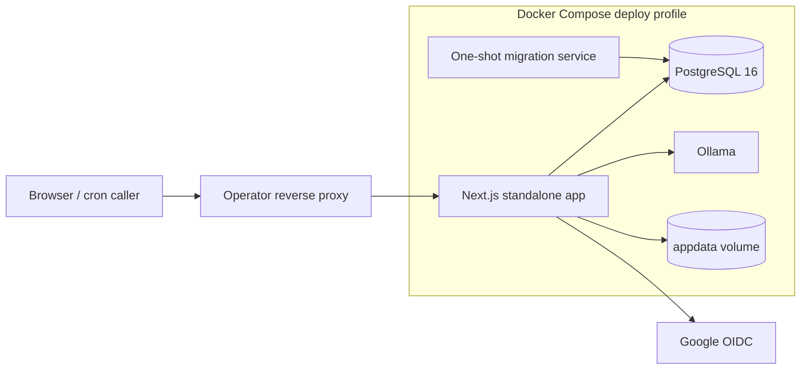

# Deployment Topology

This page distinguishes the repository's current deployable topology from the
future external-service topology. The current Compose file is authoritative
for what can be operated today.

## Purpose

- Define the runtime topology for V1, including app infrastructure, worker split, storage, and backup boundaries.
- Give implementers an operational deployment target that matches product and system assumptions.

## In Scope

- VPS app stack.
- Separate OCR/AI worker host.
- Object storage usage.
- Backup topology.
- High-level networking and operational boundaries.

## Out of Scope

- Terraform or Docker Compose manifests.
- Cloud-provider-specific scripts.
- Autoscaling beyond V1 needs.

## Decisions

- The current deployable is one Next.js standalone app plus PostgreSQL and
  Ollama, fronted by an operator-managed reverse proxy.
- Uploads and the local content repository persist in the `appdata` volume.
- Extraction, rendering, export, and notification dispatch currently run from
  the application process behind module interfaces.
- Redis, S3-compatible storage, a separate Python worker, and external
  notification adapters remain target integrations, not current runtime
  dependencies.
- Backups must include PostgreSQL and `appdata`.

## Dependencies

- Context in [`system-context.md`](./system-context.md).
- Two-repository model in [`two-repository-architecture.md`](./two-repository-architecture.md).
- NFR targets in [`../requirements/non-functional-requirements.md`](../requirements/non-functional-requirements.md).

## Acceptance Criteria

- Infrastructure engineers can infer the required runtime components from this document.
- Storage and compute split is consistent with OCR/AI workload expectations.
- Backup ownership and data boundaries are explicit.

## Current Runtime Topology

## Component Placement

- `migrate` applies forward-only SQL and exits before `app` starts.
- `app` contains the UI, API routes, all modular-monolith services, the outbox
  dispatcher, extraction adapter, and export runner.
- `db` owns canonical relational state.
- `ollama` is reachable only through the private Compose network; the optional
  host port is bound to loopback.
- `appdata` owns uploaded originals and the local content repository across
  image replacement.
- The app port is bound to host loopback. TLS and public ingress belong to the
  operator's reverse proxy.

## Target Integration Boundary

The accepted longer-term topology may replace the local adapters with Redis,
S3-compatible object storage, a separate Python worker, email/Zalo delivery,
and a remote content repository. Those systems must enter through the current
module interfaces; they do not change canonical ownership or add browser
access to storage.

## Network and Access Assumptions

- `TRUST_PROXY=1` is valid only when the reverse proxy removes client-supplied
  forwarding headers and writes trusted values.
- `POST /api/cron/dispatch` requires
  `Authorization: Bearer <CRON_SECRET>`.
- Original file download is mediated by the app.

## Backup Topology

- PostgreSQL:
  - daily logical backup
  - retention policy aligned with small-team operational capacity
- `appdata`:
  - daily volume snapshot or file-level backup
- Restore responsibility:
  - Admin/Op owns runbook validation

## Operational Notes

- V1 prioritizes simplicity and recoverability over high-availability clustering.
- Moving extraction to a separate worker remains an upgrade path if local
  processing begins to contend with interactive traffic.
- CI validates the application but is not part of runtime serving.
