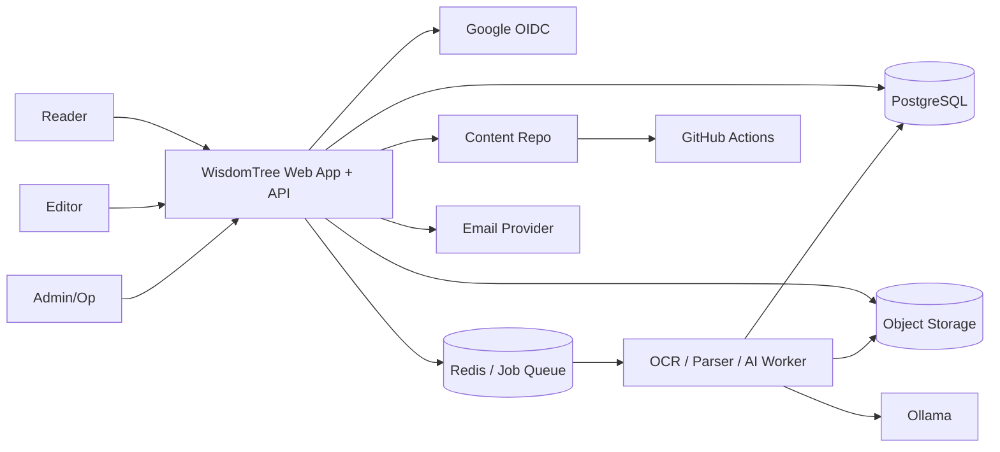

# System Context

## Purpose
- Define the external actors, system boundary, and primary runtime relationships for WisdomTree V1.
- Give contributors a shared view of what is inside the product and what sits outside it.

## In Scope
- Human actors, external services, and high-level subsystem interactions.
- The boundary between the web app, worker runtime, storage layers, and content export.

## Out of Scope
- Detailed module responsibilities or API shapes.
- Database table design.
- Deployment automation specifics.

## Decisions
- WisdomTree is a private web application with a split runtime: app stack on a VPS and OCR/AI worker on a separate host.
- Source evidence and curated knowledge are separate logical repositories.
- Exported Markdown is a downstream backup and validation artifact, not the source of truth.

## Dependencies
- Product goals in [`../product/prd.md`](../product/prd.md).
- Module responsibility details in [`module-boundaries.md`](./module-boundaries.md).
- Runtime assumptions in [`deployment-topology.md`](./deployment-topology.md).

## Acceptance Criteria
- New contributors can identify the actors and main external services without reading lower-level documents first.
- The system boundary makes the two-repository model clear.
- The context diagram is consistent with deployment and module documentation.

## Actors
- `Reader`
- `Editor`
- `Admin/Op`
- `Google OIDC`
- `Object Storage`
- `OCR/Parser Worker`
- `Ollama`
- `GitHub Actions`
- `Content Repo`
- `Email Provider`

## Context Diagram

## System Boundary Summary
- Inside WisdomTree:
  - Web app and API
  - Tree authoring and discovery
  - Source intake and review workflows
  - Job orchestration
  - Search, graph, audit, board, and notifications
- Outside but required:
  - Google OIDC for identity
  - Object storage for source files and evidence artifacts
  - OCR/AI worker host
  - GitHub Actions for exported content validation
  - Email provider for notifications

