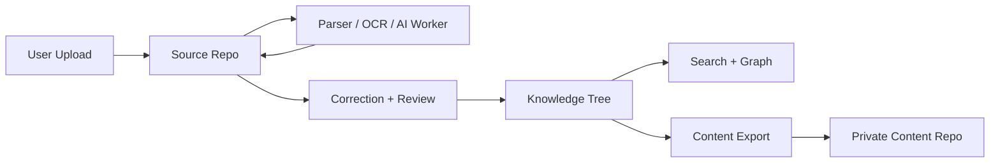

# Two-Repository Architecture

## Purpose
- Define the core V1 architectural split between `Source Repo` and `Knowledge Tree`.
- Make canonical data boundaries, promotion flow, and evidence traceability explicit.

## In Scope
- Logical repository model.
- Canonical storage ownership.
- Promotion flow from source evidence into curated tree content.
- Relationship between application database, object storage, and content export.

## Out of Scope
- Exact database tables.
- OCR engine internals.
- UI layout behavior.

## Decisions
- The system is split into two logical repositories:
  - `Source Repo`: evidence-first, multi-format, review-driven.
  - `Knowledge Tree`: curated Markdown-first, graph-friendly, user-facing.
- Original files and extraction artifacts live in object storage-backed source storage.
- Tree Markdown is canonical in PostgreSQL.
- Tree Markdown is exported one-way into a private Git content repo for backup and validation.
- Plain text from OCR is evidence material, not publishable tree content by itself.

## Dependencies
- Product problem in [`../product/prd.md`](../product/prd.md).
- Module boundaries in [`module-boundaries.md`](./module-boundaries.md).
- Lifecycle rules in [`data-model-lifecycle.md`](./data-model-lifecycle.md).

## Acceptance Criteria
- The architectural split is unambiguous enough to guide both backend schema and UI surface design.
- Engineers can trace how a source file becomes a published tree node.
- There is no confusion about where original files, plain text, and Markdown belong.

## Repository Definitions

### Source Repo
- Accepts broad source input, including files unsuitable for direct knowledge tree use.
- Stores:
  - original files
  - raw extracted text
  - corrected text
  - preview artifacts
  - provenance metadata
  - source trust state
  - review and assignment state
- Optimized for evidence, comparison, review, and promotion readiness.

### Shared Intake Projection
- `Source Intake`, `My Submissions`, and `Source Inbox` operate over a shared logical `Intake Item` projection.
- `Intake Item` carries:
  - `submission_id`
  - `item_type = source_upload | branch_gap_request`
  - `title`
  - `state`
  - `submitted_by`
  - `last_updated_at`
  - `next_action`
- File-backed intake items link to `Source` and `SourceVersion`.
- `branch-gap requests` remain non-file-backed intake items and never create `SourceVersion`.

### Knowledge Tree
- Accepts Markdown only as curated publishable content.
- Stores:
  - node Markdown
  - branch placement
  - verification state
  - links and tags
  - source excerpts and provenance references
  - task and achievement context
- Optimized for reading, linking, graph exploration, and iterative knowledge growth.

## Canonical Data Boundaries

| Data kind | Canonical home | Notes |
| --- | --- | --- |
| Original source file | Source Repo object storage | Downloadable by Admin/Op only |
| Raw extracted text | Source Repo evidence storage | Immutable |
| Corrected text | Source Repo evidence storage | Editable, versioned |
| Branch-gap request | Intake item storage and projection | No `SourceVersion`, no source trust state |
| Markdown draft | App workflow state until publish | Transitional object |
| Published node Markdown | PostgreSQL | Canonical tree content |
| Exported Markdown | Content Repo | Derived backup and validation artifact |
| Search index | Derived projection | Never canonical |

## Architecture Diagram

## Promotion Flow
1. A source file is uploaded through `Source Intake` into the Source Repo.
2. The worker parses or OCRs the file.
3. The system stores raw extracted text as immutable evidence.
4. An assigned `Editor` or `Admin/Op` corrects the text into a reviewed plain-text version.
5. The system or an assigned `Editor` creates a Markdown draft from corrected text.
6. Admin/Op reviews trust, draft quality, and provenance.
7. Approved Markdown is published into the Knowledge Tree.
8. Search and graph projections update.
9. Tree content exports into the content repo.

## Gap Request Flow
1. A `branch-gap request` is submitted through `Source Intake`.
2. The system stores it as an `Intake Item` with `item_type = branch_gap_request`.
3. `Admin/Op` triages it from `Source Inbox`.
4. The request is either:
   - converted into branch or node work
   - rejected
   - archived
5. The resulting decision is reflected back into `My Submissions`.

## Design Rationale
- Evidence review and curated knowledge have different quality thresholds and different interaction models.
- Mixing raw OCR text directly into the tree would weaken trust and make graph quality unstable.
- Separating repositories keeps the tree cleaner, while still preserving deep traceability to source material.
