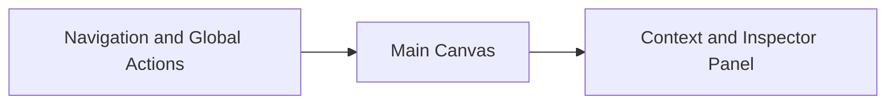

# App Layout

## Purpose
- Define the high-level workspace model for WisdomTree V1 before screen-level details are specified.

## In Scope
- Global app structure.
- Workspace zones.
- Role-sensitive layout behavior.

## Out of Scope
- Component placement inside each zone.
- Responsive mobile behavior.
- Design token specifics.

## Decisions
- V1 uses a `Workspace 3-zone layout`.
- The layout prioritizes orientation and context over full-screen single-document editing.
- Graph context exists both as a dedicated surface and as contextual support.

## Dependencies
- UI principles in [`ui-principles.md`](./ui-principles.md).
- Navigation model in [`navigation-model.md`](./navigation-model.md).
- Screen inventory in [`screen-inventory.md`](./screen-inventory.md).

## Acceptance Criteria
- The layout model is general enough to support both user exploration and admin review work.
- Screen specs can inherit a shared layout language from this document.
- The layout does not depend on a future mobile design.

## Workspace 3-Zone Layout

### Zone 1: Navigation and Global Actions
- Main module navigation.
- Branch switch or context switch.
- Global search trigger.
- Notifications.
- User menu and role-aware quick actions.

### Zone 2: Main Canvas
- Primary screen content.
- Search results, node reading view, branch hub, source detail, review comparison, or board content.
- Should be the visual anchor of every workflow.

### Zone 3: Context and Inspector Panel
- Metadata, trust badges, relations, source excerpt, task context, activity, or review notes.
- Collapsible where necessary, but conceptually always available.

## Layout Behavior by Surface
- User surfaces:
  - center-heavy
  - relation context in inspector
  - contribution and submission tracking actions remain lightweight and do not expose full source internals
- Editor surfaces:
  - add edit controls and template assistance in the canvas
  - preserve context panel for links and trust
- Admin/Op surfaces:
  - permit denser use of inspector and side-by-side comparison panels

## Layout Diagram

